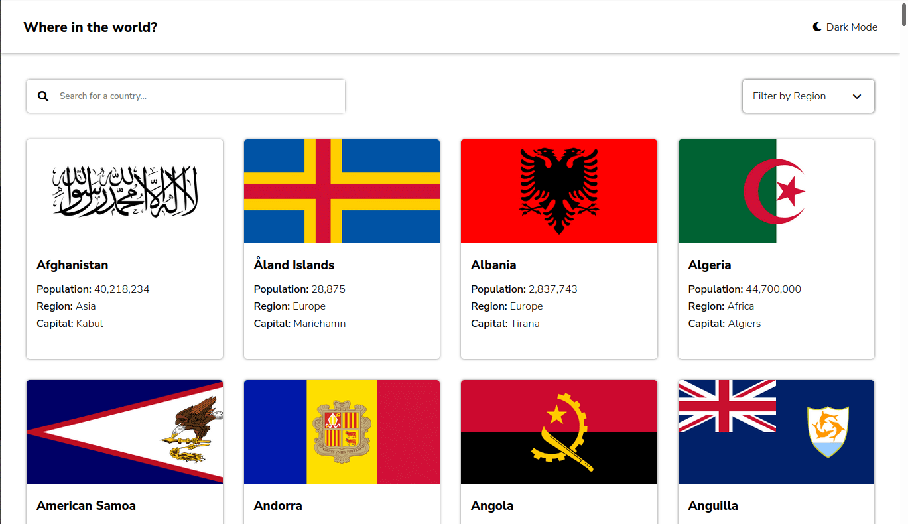

# Frontend Mentor - REST Countries API with color theme switcher solution

This is a solution to the [REST Countries API with color theme switcher challenge on Frontend Mentor](https://www.frontendmentor.io/challenges/rest-countries-api-with-color-theme-switcher-5cacc469fec04111f7b848ca). Frontend Mentor challenges help you improve your coding skills by building realistic projects. 

## Table of contents

- [Overview](#overview)
  - [The challenge](#the-challenge)
  - [Screenshot](#screenshot)
  - [Links](#links)
- [My process](#my-process)
  - [Built with](#built-with)
  - [What I learned](#what-i-learned)
- [Author](#author)

## Overview

### The challenge

Users should be able to:

- See all countries from the API on the homepage
- Search for a country using an `input` field
- Filter countries by region
- Click on a country to see more detailed information on a separate page
- Click through to the border countries on the detail page
- Toggle the color scheme between light and dark mode *(optional)*

### Screenshot

### Links

- Solution URL: [https://github.com/rochelin-shikamaru/app-country](https://github.com/rochelin-shikamaru/app-country)
- Live Site URL: [https://app-country-rochelin.netlify.app/](https://app-country-rochelin.netlify.app/)

## My process

### Built with

- Semantic HTML5 markup
- SCSS
- Flexbox
- CSS Grid
- JavaScript
- Media Queries

### What I learned
in this challenge i learned how to use the fetch api to filter the data and the grid property to have more easily a responsive rendering

### Useful resources

- [https://www.ibrahima-ndaw.com/blog/build-a-search-filter-with-javascript/](https://www.ibrahima-ndaw.com/blog/build-a-search-filter-with-javascript/) - This helped me for filtring a data. I really liked this pattern and will use it going forward.

## Author

- Website - [rochelin-portfolio](https://rochelin-portfolio.netlify.app)
- Frontend Mentor - [@rochelin-shikamaru](https://www.frontendmentor.io/profile/rochelin-shikamaru)
- Twitter - [@rochelin9](https://twitter.com/rochelin9)

